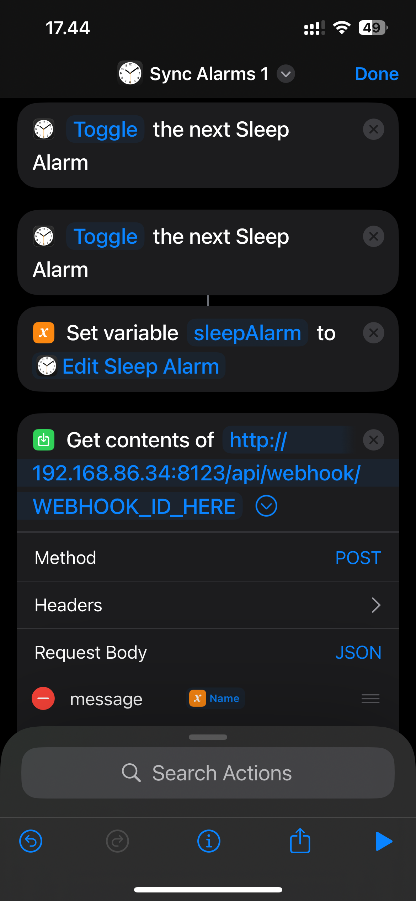
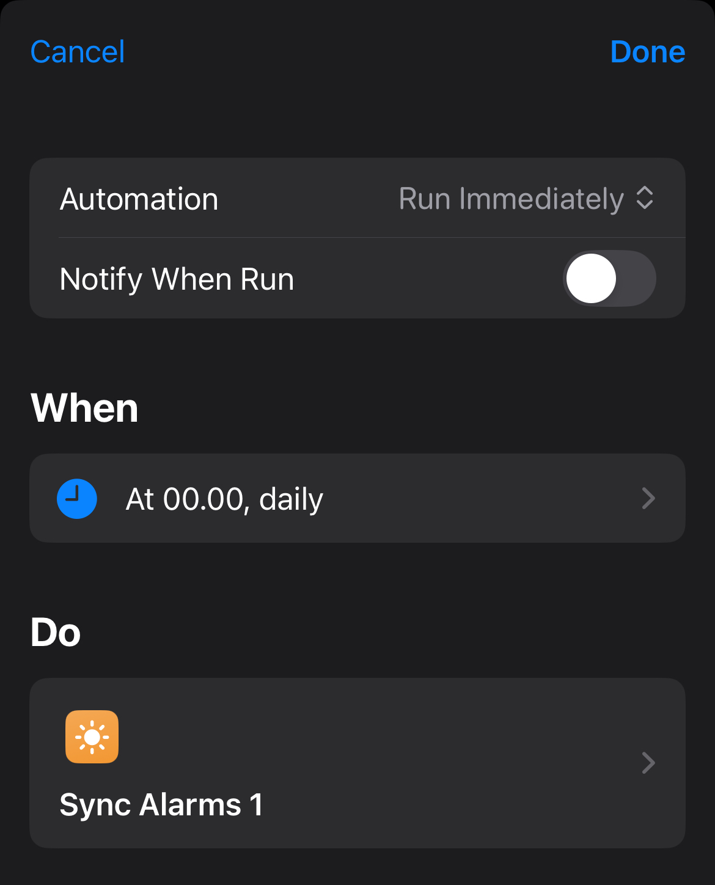
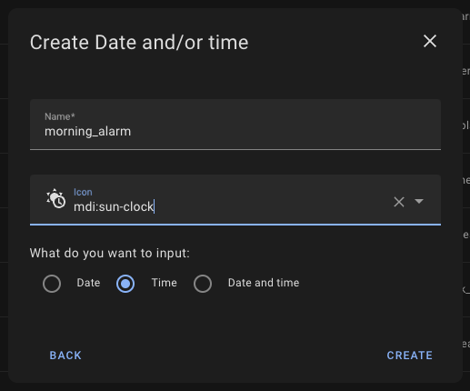
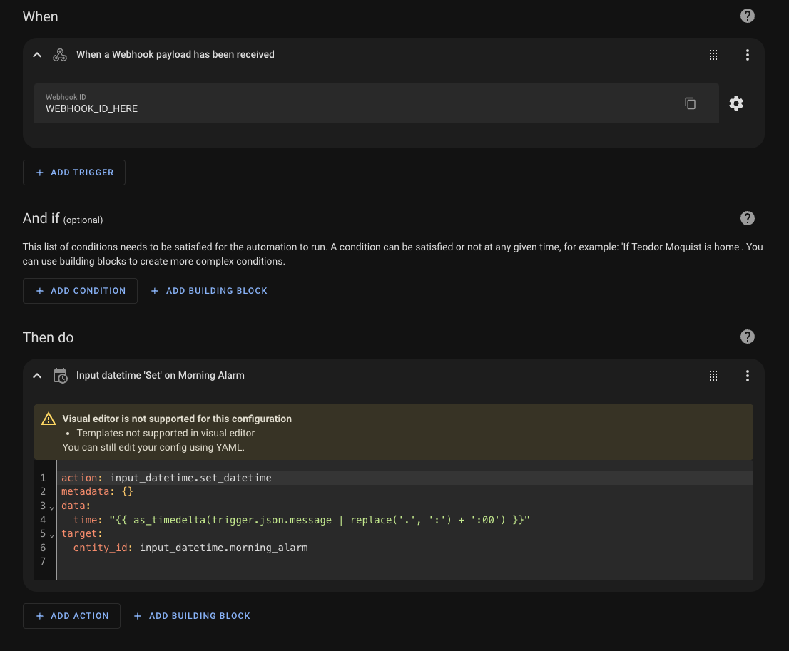

# Get your iphone wakeup alarm into home assistant


I had a Philips Hue automation in their app that gradually turned on the lights in my bedroom. However, I encountered a problem where it would also activate when I wasn’t home. To fix this, I found a script online that replicated the automation from the Philips Hue app but instead implemented it in Home Assistant, which resolved the issue.

But then I faced another challenge: if I needed to wake up at a different time, I had to change both my iPhone alarm and the Home Assistant alarm manually. So, I researched how to synchronize them.

Here’s how I did it:

#### Disclaimer: This method only works if you're connected to the same Wi-Fi network as your Home Assistant. (It should also be possible to get it working offline with some modifications.)

## Apple Shortcuts

### How to

1. Add a Shortcut on your iphone [https://www.icloud.com/shortcuts/029ab5f2503a4a3eaa549f7fdeae1048]


2. Add a Shortcut automation on your iphone (mine just run every week night at 00:00)


## Home assistant

### How to

1. Create a Helper


2. Create a Automation


```
action: input_datetime.set_datetime
metadata: {}
data:
  time: "{{ as_timedelta(trigger.json.message | replace('.', ':') + ':00') }}"
target:
  entity_id: input_datetime.morning_alarm
```
