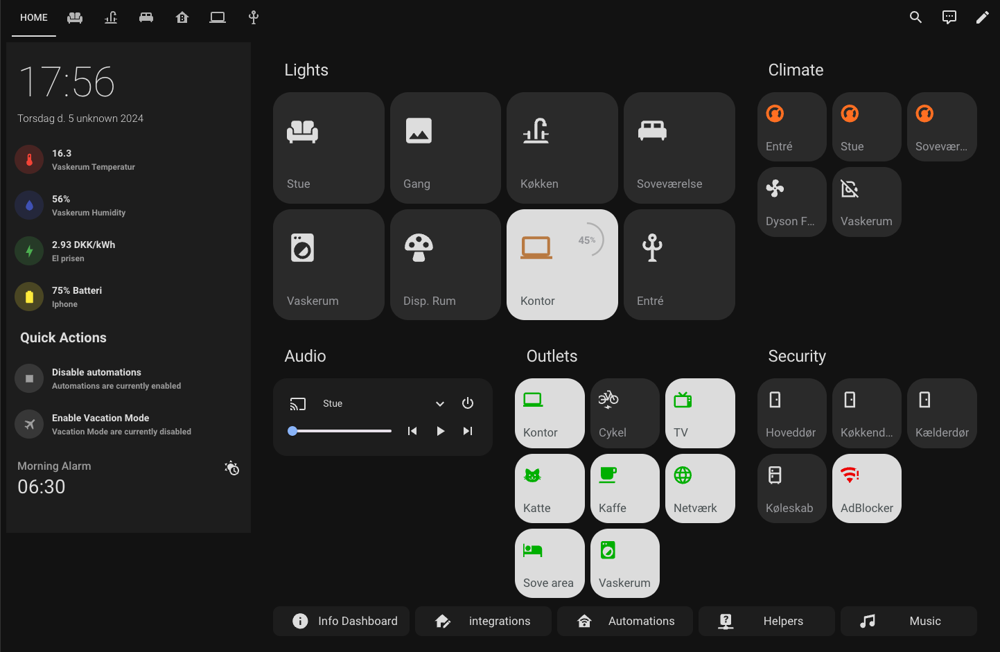
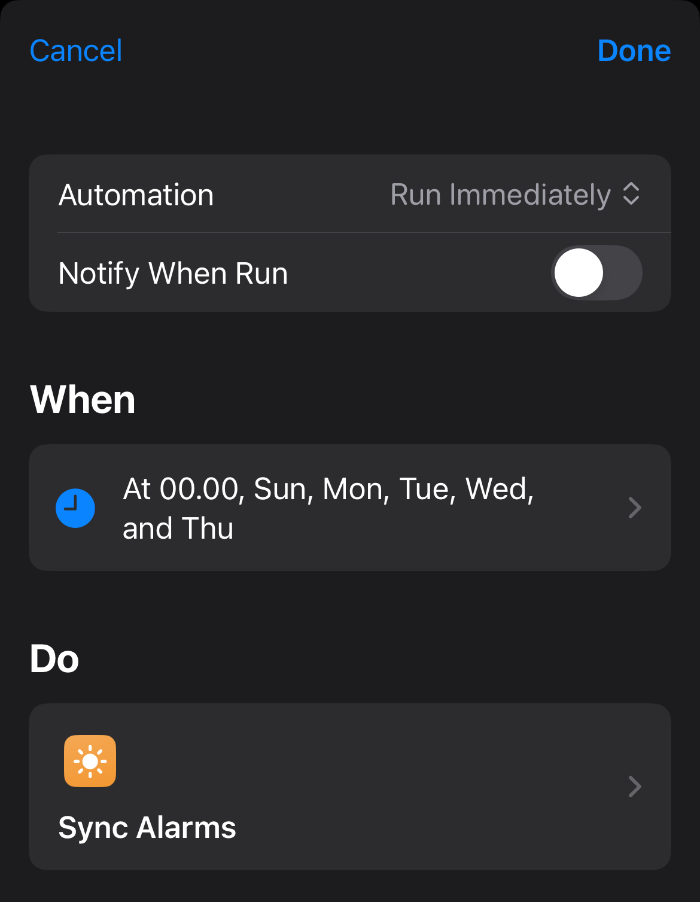

# Get your iphone wakeup alarm into home assistant

I had the philips hue automation in their app, where its slowly turned on my lights in my bedroom. I just had one problem where its also did it when i wasn't home.
So i found a script on the internet that i could do the same as the automation they did in the philips hue app just in home assistant that fixed that.

But then i had another problem, if i was going to wake up another time then i needed to change both my iphone alarm and the HA alarm, so i tried to research how to get them synced.

This is the way i did it.

#### Disclaimer: This will only work if you are on the same wifi as your HA (but its should posible to get it work offline too)

## Apple Shortcuts

### How to

1. Add a Shortcut on your iphone [https://www.icloud.com/shortcuts/029ab5f2503a4a3eaa549f7fdeae1048]

2. Add a Shortcut automation on your iphone (mine just run every night at 00:00)

## Home assistant

### How to

1. Create a Helper

2. Create a Automation

